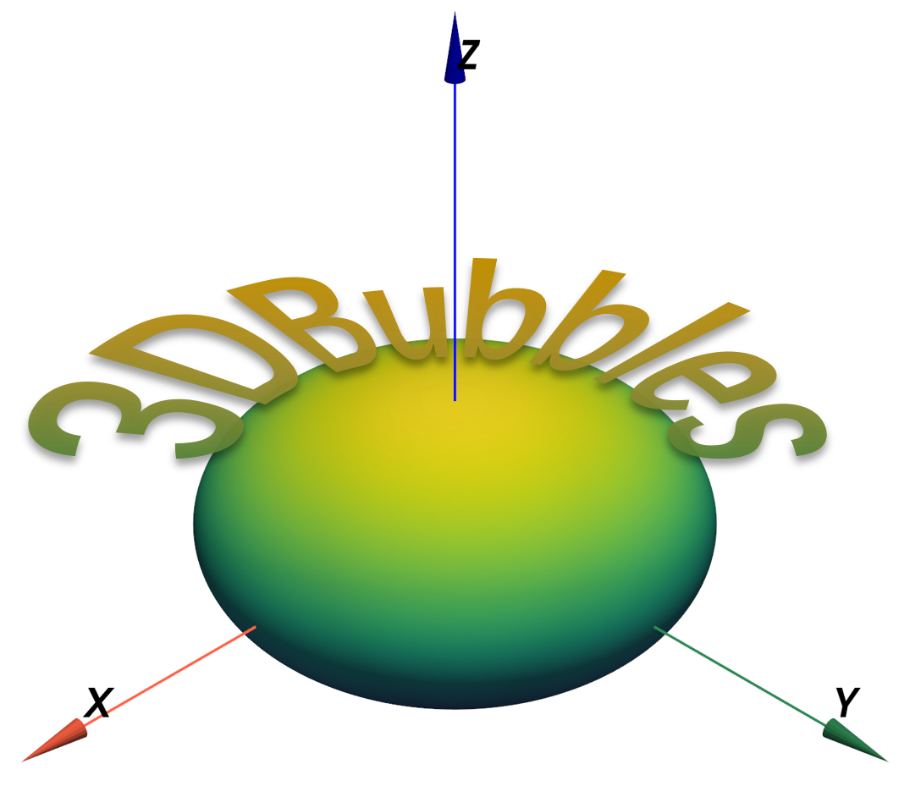
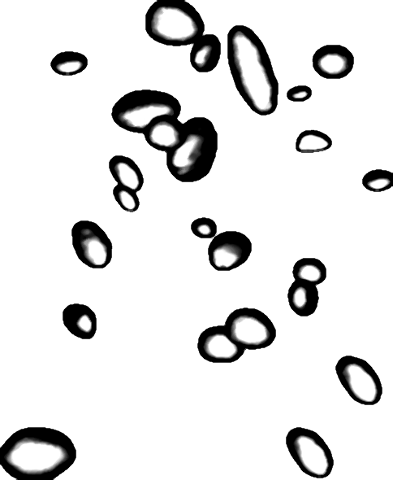
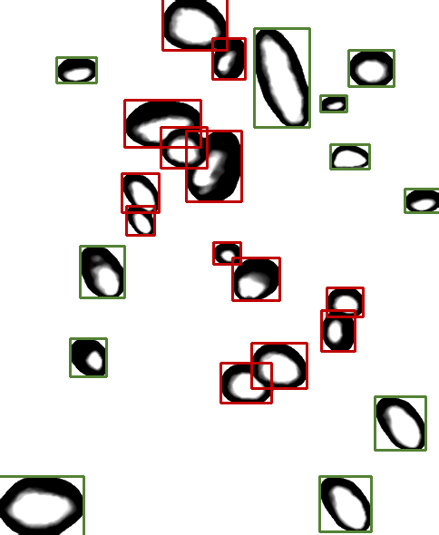
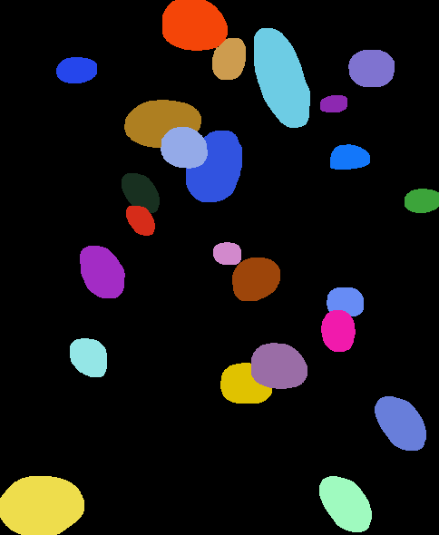
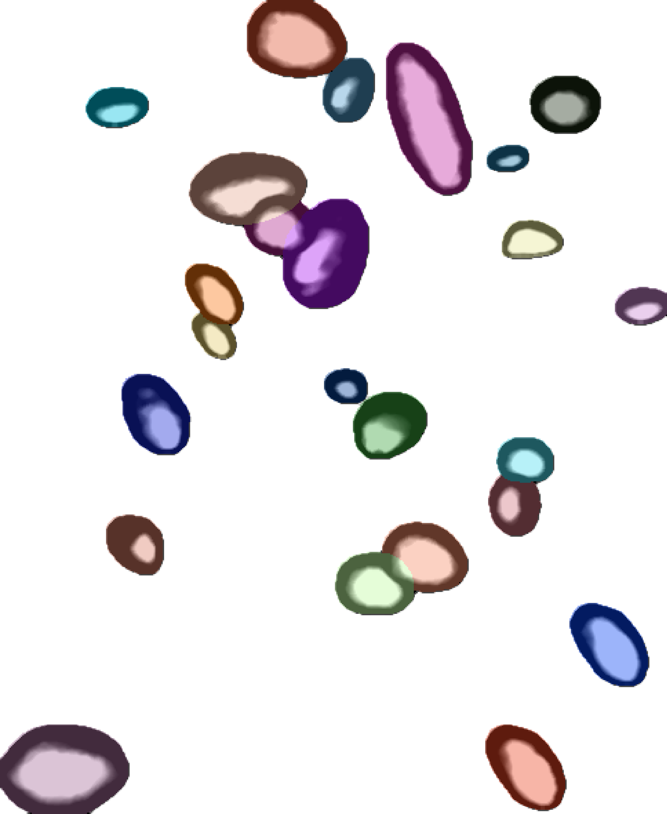
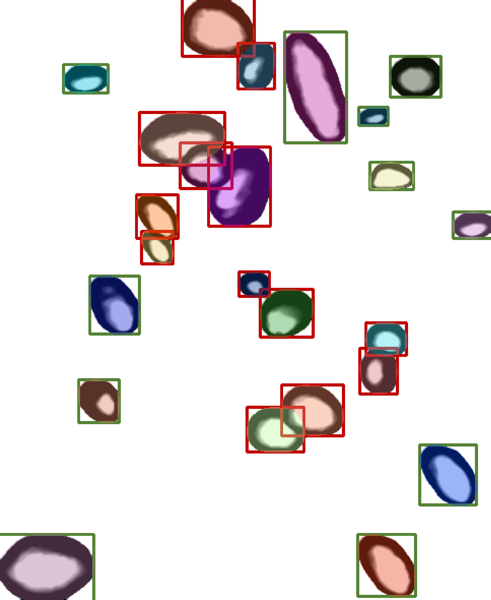

**语言版本: [English](README.md), [中文](README_zh.md).**

# 3DBubbles


遵循MIT协议的公开的气液两相流数据集（3DBubbles），提供高精度气泡流3D、2D数据及统计信息。3DBubbles包括以下三类数据类型：
1. "stl"格式的单气泡3D结构。气泡结构由静态气液流场模体产生，通过自主研发的高空间分辨率X射线CT系统数字化和后处理；
2. "png"格式的单气泡2D图像。通过光栅化渲染3D点云获得，每个3D气泡提供了26个角度的渲染图像。
3. 3D气泡流。包括宏观的“stl”格式的3D气泡流和光栅化渲染的2D气泡流图像。

注意：
1. 前两项的数据已在Kaggle平台开源，数据集链接：<https://www.kaggle.com/datasets/mujishan/3dbubbles>。如果您有需要，请按照最后的格式引用。
2. 3D气泡流数据通过[FlowRenderer.py](FlowRenderer.py)文件生成。

## 3DBubbles数据集
    3DBubbles
    ├── parameters.csv 3D气泡和2D投影图像的结构参数及几何信息
    ├── reconstruction_characterization.csv 重建指标与结构参数（N=2~20）
    ├── mesh (10823个stl格式的气泡mesh文件)
    │   ├── 00001.stl
    │   ├── 00002.stl
    │   ├── ……
    │   └── 10823.stl  
    ├── projection (10823×26个投影图像)
    │   ├── 00001
    │   │   ├── Sphere_0.00_0.00_1.00_scale=39.png  
    │   │   ├── Sphere_0.00_0.00_-1.00_scale=39.png    
    │   │   ├── ……
    │   │   └── Sphere_-1.00_0.00_0.00_scale=39.png
    │   ├── 00002
    │   ├── ……
    │   └── 10823
    └── SH_coefficient (10823×20个球谐系数)
        ├── 00001
        │   ├── N=1.npy  
        │   ├── N=2.npy
        │   ├── ……
        │   └── N=20.npy
        ├── 00002
        ├── ……
        └── 10823

演示：

## Usage
### 测试环境
Current version only supports training and inference on CPU. It works well under dependencies as follows:
* Ubuntu 24.04 / Windows 10 Professional
* Python 3.8 / 3.12
* numpy 1.24.4 / 1.26.0
* pyvista 0.44.1 / 0.44.1
* scipy 1.10.1 / 1.14.1
* matplotlib 3.7.5 / 3.9.3

### 数据准备Data preparation
请提前在Kaggle平台下载3DBubbles数据集：<https://www.kaggle.com/datasets/mujishan/3dbubbles>，共有10823个stl文件。

**我们在GitHub仅上传了3DBubbles数据集中的20个stl文件。**

### 3D气泡流生成
运行[FlowRenderer.py](FlowRenderer.py)文件。

例：生成1个5mm立方体的通道内气含率1%的气泡流及渲染图：
```
python .\FlowRenderer.py -num 1 -x 5 -y 5 -hh 5 --gas_holdup 0.01
```
运行结果：

[气泡流三维模型](3Dbubbleflowrender/20250110T172559-117775/000/0.01_fibonacci.stl)


气泡流图像：



带有检测框的气泡流图像：



气泡掩码图像：



气泡流与掩码图像：



气泡流与检测框和掩码图像：



argparse提供的可选参数如下：
```
usage: FlowRenderer.py [-h] [--stl_path STL_PATH] [--save_path SAVE_PATH] [-num FLOW_NUM] [-x VOLUME_SIZE_X] [-y VOLUME_SIZE_Y] [-hh VOLUME_HEIGHT] [--gas_holdup GAS_HOLDUP] [-a ALPHA] [-t TRUNCATION]
                       [--poisson_max_iter POISSON_MAX_ITER] [--sample_spacing SAMPLE_SPACING]

流场生成器与渲染器

options:
  -h, --help            show this help message and exit
  --stl_path STL_PATH   STL文件的路径
  --save_path SAVE_PATH
                        保存路径
  -num FLOW_NUM, --flow_num FLOW_NUM
                        生成数量
  -x VOLUME_SIZE_X, --volume_size_x VOLUME_SIZE_X
                        流场宽度[mm]
  -y VOLUME_SIZE_Y, --volume_size_y VOLUME_SIZE_Y
                        流场深度[mm]
  -hh VOLUME_HEIGHT, --volume_height VOLUME_HEIGHT
                        流场高度[mm]
  --gas_holdup GAS_HOLDUP
                        气含率
  -a ALPHA, --alpha ALPHA
                        向量指数:Alpha
  -t TRUNCATION, --truncation TRUNCATION
                        截断值
  --poisson_max_iter POISSON_MAX_ITER
                        泊松圆盘采样最大迭代次数
  --sample_spacing SAMPLE_SPACING
                        点云上采样的采样距离
```

## Coming soon

更新日志请查看[Update_log.md](Update_log.md)。
### 气泡流
1.  0.5%、1%、2%等不同气含率的三维气泡流场（mesh信息，STL格式）；
2.  气泡流统计信息（气泡尺寸分布BSD，气泡角度分布BRD，气泡位置分布BPD等）；
3.  增加更多约束条件。

## 联系作者

作者：于宝地（Baodi Yu），e-mail: <yubaodi20@ipe.ac.cn>

## 引用
Please cite our paper if you find this code useful:
 ```
@misc{3DBubbles,
  author={Baodi Yu, Qian Chen, Yanwei Qin1, Sunyang Wang, Xiaohui Su, Fanyong Meng},
  title={3DBubbles: an experimental dataset for model training and validation},
  year={2025}
  howpublished = {\url{https://github.com/Baodi-Yu/3DBubbles}},
}
 ```